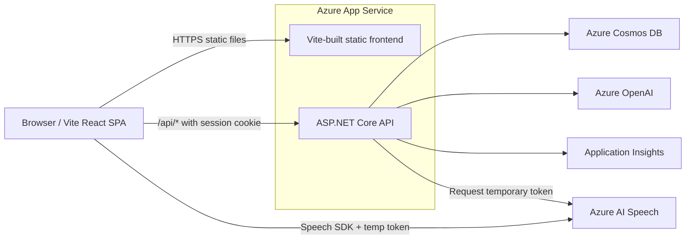

# Architecture

This document describes the planned architecture for the AI Interview Simulator.

The system is intentionally lightweight, Azure-native, and aimed at a personal invite-only portfolio project.

---

## Goals

- Provide realistic interview practice with AI-generated questions and feedback
- Keep infrastructure and operational cost low
- Use Azure-native services end to end
- Avoid custom authentication and password management
- Support text-based interviews first
- Add optional voice input and output later
- Keep the system simple enough to complete as a solo project
- Make the project suitable for portfolio and demo usage

---

## Non-Goals

The following items are out of scope for the initial version:

- Public multi-tenant SaaS
- Payment or subscription system
- Custom email/password authentication
- Admin panel
- Real-time full-duplex voice conversation
- Backend audio streaming
- SignalR-based live conversation
- Camera/video recording
- Emotion detection

---

## High-Level Architecture



The browser loads the Vite-built SPA from App Service. ASP.NET Core serves API endpoints, owns authentication and authorization, and handles all secret-bearing integrations and persistence.

---

## Request Flow

1. A user opens the Vite React SPA through Azure App Service.
2. The user signs in with GitHub OAuth through ASP.NET Core and receives an authenticated session cookie.
3. The frontend calls `/api/*` endpoints for interview setup, session management, feedback, history, and dashboard data.
4. ASP.NET Core validates the session and invite-only policy, reads or writes Cosmos DB, and calls Azure OpenAI when AI output is needed.
5. For voice interactions, the browser requests a short-lived Speech token from the backend and talks directly to Azure AI Speech.

---

## Components

### React Frontend

The frontend is built with React and TypeScript.

Responsibilities:

- Render the interview setup flow
- Render the active interview session
- Allow text answer submission
- Display AI-generated feedback
- Display session history and session details
- Display basic dashboard and progress information
- Integrate with Azure Speech SDK for optional voice input and output
- Call backend API endpoints under `/api/*`
- Redirect users to backend auth routes such as `/login` and `/logout`

The frontend must not contain Azure OpenAI keys, Speech keys, or Cosmos DB credentials.

### Azure App Service

Azure App Service hosts the web application and API.

Responsibilities:

- Host the Vite-built static frontend
- Provide HTTPS
- Run ASP.NET Core API endpoints
- Support GitHub OAuth login
- Issue secure HTTP-only session cookies
- Enforce invite-only access through backend authorization
- Provide GitHub Actions deployment integration

Planned access model:

- Public landing page
- Authenticated login and logout routes
- Invite-only access to interview and analytics API routes

### ASP.NET Core API

ASP.NET Core provides the backend API.

Responsibilities:

- Perform GitHub OAuth sign-in callback handling
- Issue and validate secure HTTP-only cookies
- Enforce invite-only authorization defensively
- Create interview sessions
- Accept submitted answers
- Call Azure OpenAI for question generation and answer evaluation
- Store session and turn data in Cosmos DB
- Return history and dashboard data
- Generate final session summaries
- Issue temporary Azure Speech tokens
- Log operation metadata to Application Insights

API endpoints are exposed under `/api/*`.

### Cosmos DB

Cosmos DB stores user interview data.

Planned setup:

```text
API: Cosmos DB for NoSQL
Tier: Free tier
Region: Single region
Database: InterviewSimulatorDb
Container: appData
Partition key: /userId
```

The initial model uses one container with multiple document types:

```text
type = profile
type = session
type = turn
```

This keeps user-scoped data in the same partition while avoiding large session documents for dashboard and list queries.

### Azure OpenAI

Azure OpenAI powers the AI interview logic.

Used for:

- Generating the first interview question
- Evaluating user answers
- Generating adaptive follow-up questions
- Generating final session summaries
- Optionally generating dashboard or progress insights later

The backend calls Azure OpenAI. The frontend never calls Azure OpenAI directly.

Prompt versions should be tracked, and AI usage metadata should be stored where useful.

Example metadata:

```json
{
  "model": "gpt-4o-mini",
  "promptVersion": "technical-evaluation-v1",
  "inputTokens": 2100,
  "outputTokens": 600
}
```

### Azure AI Speech

Azure AI Speech provides optional voice interaction.

Used for:

- Text-to-speech for AI interview questions
- Speech-to-text for user answers

The browser uses Azure Speech SDK directly with a temporary token issued by the backend.

ASP.NET Core does not process or stream live microphone audio.

### Application Insights

Application Insights is used for basic monitoring and diagnostics.

Logged data should include:

- API operation names
- Execution duration
- Success or failure status
- AI model name
- Prompt version
- Token counts if available
- Estimated cost if calculated

Sensitive or large data should not be logged by default.

Avoid logging:

- Full prompts
- Full user answers
- Full AI responses
- Speech transcripts unless explicitly needed for debugging

---

## Authentication and Authorization

Authentication is handled by ASP.NET Core using GitHub OAuth and cookie sessions.

Initial provider:

```text
GitHub
```

The app uses GitHub's immutable numeric user ID as the stable external identifier, not the GitHub username.

Internal app user id format:

```text
github|{githubUserId}

example:
github|123456789
```

Possible later provider:

```text
Microsoft Entra ID
```

Invite-only access is implemented using a configuration-based allowlist of canonical application user IDs.

Configuration values:

```text
AccessControl:AdminUserIds
AccessControl:InvitedUserIds
```

Admin users are treated as invited users for access control.

```text
github|{githubUserId}
```

Protected routes require the backend `InvitedUser` authorization policy.

Examples of protected routes:

```text
/api/sessions/*
/api/dashboard/*
/api/speech/token
```

The backend also checks the authenticated user and effective access state defensively.

Frontend route guards are a UX optimization only. Backend authorization policies on `/api/*` are the enforcement boundary.

The `/api/me` endpoint should return a normalized auth view such as:

```json
{
  "isAuthenticated": true,
  "isInvited": true,
  "isAdmin": false,
  "userId": "github|123456789",
  "identityProvider": "github",
  "displayName": "octocat",
  "githubLogin": "octocat",
  "avatarUrl": "https://avatars.githubusercontent.com/u/123456789"
}
```

---

## Planned API Surface

```text
GET  /api/health
GET  /api/me
POST /api/sessions
POST /api/sessions/{sessionId}/turns
POST /api/sessions/{sessionId}/complete
GET  /api/sessions
GET  /api/sessions/{sessionId}
GET  /api/dashboard/summary
POST /api/speech/token
```

These endpoints are enough to support the phase 1 foundation, the text-based interview MVP, and later voice support.

---

## Main Flows

### Health Check

`GET /api/health` returns a simple readiness response for local development and deployment verification.

### Get Current User

`GET /api/me` returns the authenticated user identity and role information needed by the frontend.

### Start Interview

1. The user selects role, seniority, topic, and interview type.
2. The frontend posts the configuration to `POST /api/sessions`.
3. The backend creates the session record in Cosmos DB.
4. The backend calls Azure OpenAI for the first question.
5. The frontend displays the question and session state.

### Submit Answer

1. The user submits a text answer.
2. The frontend posts it to `POST /api/sessions/{sessionId}/turns`.
3. The backend stores the turn in Cosmos DB.
4. The backend calls Azure OpenAI for evaluation and the next question.
5. The frontend shows feedback and the next step.

### Complete Session

1. The user finishes the interview or reaches the configured limit.
2. The frontend calls `POST /api/sessions/{sessionId}/complete`.
3. The backend generates the final summary.
4. The backend persists the completed session and summary.

### Get Session History

`GET /api/sessions` returns a user-scoped list of interview sessions for the history page.

### Get Session Detail

`GET /api/sessions/{sessionId}` returns the session, turns, feedback, and summary for the detail page.

### Get Dashboard Summary

`GET /api/dashboard/summary` returns the user’s basic progress metrics.

### Get Speech Token

`POST /api/speech/token` returns a short-lived token for Azure AI Speech.

---

## Cosmos DB Data Model

### Why One Container?

One container keeps the data model simple, reduces overhead, and makes user-scoped reads efficient with a `userId` partition key.

### Document Types

- `profile` for optional user preferences
- `session` for interview sessions and summary metadata
- `turn` for questions, answers, and evaluation output

### Session Document

Session documents may store denormalized summary metrics such as `overallScore`, average dimension scores, answered count, and completion status. This allows dashboard and history pages to query session documents without scanning every turn document.

```json
{
  "id": "session|session_123",
  "sessionId": "session_123",
  "userId": "github|123456789",
  "type": "session",

  "role": "frontend-engineer",
  "seniority": "mid",
  "topic": "react",
  "interviewType": "technical",

  "status": "completed",
  "questionCount": 5,
  "answeredCount": 5,

  "createdAt": "2026-07-15T10:00:00Z",
  "completedAt": "2026-07-15T10:25:00Z",

  "summary": {
    "overallScore": 78,
    "dimensionScores": {
        "clarity": 4.2,
        "depth": 3.6,
        "correctness": 4.4
    },
    "highlights": [],
    "improvements": []
  }
}
```

### Turn Document

```json
{
  "id": "turn|session_123|1",
  "userId": "github|123456789",
  "sessionId": "session_123",
  "turnNumber": 1,
  "type": "turn",

  "question": "Tell me about a time you handled a production incident.",
  "answer": "...",

  "evaluation": {
    "overallScore": 78,
    "dimensionScores": {
      "clarity": 4,
      "depth": 3,
      "correctness": 4
    },
    "strengths": [],
    "improvements": [],
    "followUpQuestion": "..."
  },

  "aiMetadata": {
    "model": "gpt-4o-mini",
    "promptVersion": "technical-evaluation-v1",
    "inputTokens": 2100,
    "outputTokens": 600
  },

  "createdAt": "2026-07-15T10:08:00Z"
}
```

### Optional Profile Document

```json
{
  "id": "profile",
  "userId": "github|123456789",
  "type": "profile",
  "preferredRole": "frontend-engineer",
  "preferredSeniority": "mid"
}
```

### Query Patterns

- Session list reads by `userId` and sorts by `createdAt`
- Session detail reads by `userId` and `sessionId`
- Dashboard summary aggregates a user’s sessions and turns

---

## AI Evaluation Design

The AI response should be structured so the frontend can render feedback consistently.

### Technical Rubric

Measures correctness, depth, tradeoff awareness, and practical implementation details.

### Behavioral Rubric

Measures clarity, ownership, communication, and STAR-style structure.

### System Design Rubric

Measures requirements capture, architecture, scalability, reliability, and operational thinking.

### Score Scale Definition

- `overallScore` is an integer from 0 to 100.
- `dimensionScores` values are integers from 1 to 5.
- 1 means weak, 3 means acceptable, and 5 means strong.
- Any displayed grade or label in the UI should be derived from these values deterministically.

### Evaluation Output Shape

```json
{
  "overallScore": 78,
  "dimensionScores": {
    "clarity": 4,
    "depth": 3,
    "correctness": 4
  },
  "strengths": ["Clear structure"],
  "improvements": ["Add more tradeoff discussion"],
  "followUpQuestion": "How would you handle retries?"
}
```

Prompt versioning should be explicit so feedback changes can be traced.

---

## Speech Design

Azure Speech is optional and additive.

- The browser requests a temporary token from the backend
- The browser uses Azure Speech SDK for text-to-speech and speech-to-text
- The backend never receives raw audio streams
- Voice UX must fail safely back to text-only interaction

---

## Deployment

Planned deployment shape:

- Vite frontend built and served from ASP.NET Core static files
- ASP.NET Core deployed to Azure App Service
- Cosmos DB provisioned separately
- Azure OpenAI and Azure AI Speech configured through Azure resources and app settings
- Application Insights connected to the App Service app

The repository should remain deployable from a clean clone with documented environment variables and local secrets handling.

---

## Local Development

Minimal local setup:

- Run the Vite frontend using the Vite dev server.
- Run the ASP.NET Core API locally for API and auth routes.
- Configure the Vite dev server to proxy `/api/*`, `/login`, `/logout`, and OAuth callback routes to ASP.NET Core if needed.
- Configure a GitHub OAuth app for localhost callback URLs.
- Use local secrets for OAuth client secret and Azure service keys.
- Point API configuration to development resources where possible.
- Verify `/api/health`, `/api/me`, and one Cosmos read/write before implementing interview flow.

Production setup:

- Build the Vite frontend into static files.
- Serve the built frontend from ASP.NET Core static files on Azure App Service.

---

## Repository Structure

```text
web/      # Vite React frontend
api/      # ASP.NET Core backend, serves API and built frontend in production
infra/    # Bicep templates and deployment scripts
docs/     # Architecture, roadmap, ADRs, milestones
```

The repository is intentionally split into frontend, backend, infrastructure, and documentation areas.

---

## Configuration and Secrets

```text
AZURE_OPENAI_ENDPOINT
AZURE_OPENAI_DEPLOYMENT_NAME
AZURE_OPENAI_API_KEY
COSMOS_DB_CONNECTION
SPEECH_KEY
SPEECH_REGION
APPLICATIONINSIGHTS_CONNECTION_STRING
```

Local secrets should stay out of source control.

Production secrets should be stored in Azure application settings or equivalent managed configuration.

Managed identity can be considered later, especially for Cosmos DB access.

---

## Security Considerations

- Keep `/api/health` anonymous or minimally protected for deployment verification
- Keep `/api/me` available to authenticated users
- Protect session, dashboard, AI, and speech endpoints with the `InvitedUser` authorization policy
- Check authorization policy in ASP.NET Core defensively
- Keep frontend route guards for UX only; never treat them as security boundaries
- Never trust `sessionId` alone
- Always access Cosmos DB using the current user’s partition key
- Never expose Azure OpenAI keys to the frontend
- Never expose Azure Speech keys to the frontend
- Use `Secure`, `HttpOnly`, and appropriate `SameSite` cookie settings
- Enforce anti-forgery (CSRF) protection on state-changing cookie-authenticated endpoints
- Limit answer length
- Limit question count
- Limit recording duration
- Avoid logging sensitive user content

Example safe session read:

```text
id = session|{sessionId}
partitionKey = currentUserId
```

Unsafe pattern to avoid:

```text
Query by sessionId only
```

---

## Cost Controls

Planned controls:

- Invite-only access
- App Service plan sized for MVP load
- Cosmos DB free tier
- Single-region Cosmos DB
- Mini Azure OpenAI model by default
- Max questions per session
- Max answer length
- Max sessions per user per day
- Max speech recording duration
- Do not auto-read long feedback with TTS
- Application Insights sampling or daily cap
- Azure budget alerts

---

## Open Questions

- Should Entra ID be enabled in phase 1 or deferred to a later phase?
- Exact Azure OpenAI model and deployment name
- Exact Azure region
- Whether to use managed identity or keys for Cosmos DB initially
- How much dashboard functionality belongs in MVP
- Whether to store profile preferences in v1
- Whether all scoring should be computed in the backend or partially by AI
